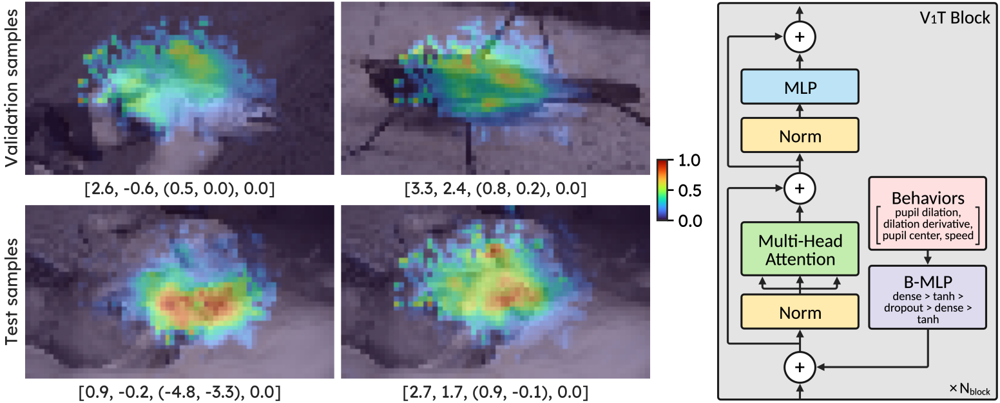

# V<font size='5'>1</font>T: Large-scale mouse V1 response prediction using a Vision Transformer

[](https://arxiv.org/abs/2302.03023)



Authors: Bryan M. Li, Isabel M. Cornacchia, Nathalie L. Rochefort, Arno Onken

```bibtex
@article{li2023v1t,
    title={V1T: large-scale mouse V1 response prediction using a Vision Transformer},
    author={Li, Bryan M and Cornacchia, Isabel M and Rochefort, Nathalie L and Onken, Arno},
    journal={arXiv preprint arXiv:2302.03023},
    year={2023}
}
```

## Acknowledgement

We sincerely thank [Willeke et al.](https://arxiv.org/abs/2206.08666) for organizing the [Sensorium](https://sensorium2022.net/home) challenge and, along with [Franke et al.](https://www.nature.com/articles/s41586-022-05270-3), for making their high-quality large-scale mouse V1 recordings publicly available. This codebase is inspired by [sinzlab/sensorium](https://github.com/sinzlab/sensorium), [sinzlab/neuralpredictors](https://github.com/sinzlab/neuralpredictors) and [sinzlab/nnfabrik](https://github.com/sinzlab/nnfabrik). 

## File structure
The codebase repository has the following structure. Check [.gitignore](.gitignore) for the ignored files.
```
sensorium2022/
  data/
    sensorium/
      static21067-10-18-GrayImageNet-94c6ff995dac583098847cfecd43e7b6.zip
      ...
    franke2022/
      static25311-4-6-ColorImageNet-104e446ed0128d89c639eef0abe4655b.zip
      ...
    README.md
  misc/
  src/
    v1t/
      ...
  .gitignore
  README.md
  setup.sh
  demo.ipynb
  submission.py
  sweep.py
  train.py
  ...
```
- [`demo.ipynb`](demo.ipynb) demonstrates how to load the best V1T model and inference the Sensorium+ test set, as well as extracting the attention rollout maps.
- [`submission.py`](submission.py) creates the submission `csv` files for the Sensorium challenge.
- [`sweep.py`](sweep.py) performs hyperparameter tuning using [Weights & Biases](https://wandb.ai/site).
- [`train.py`](train.py) contains the model training procedure.
- [data](data/) store the datasets, please check [data/README.md](data/README.md) for more information.
- [misc](misc/) contains scripts and notebooks to generate various plots and figures used in the paper.
- [src/v1t](src/v1t/) contains the code for the main Python package.

## Installation
- Create a new [conda](https://docs.conda.io/en/latest/miniconda.html) environment in Python 3.10.
  ```bash
  conda create -n v1t python=3.10
  ```
- Activate `v1t` virtual environment
  ```bash
  conda activate v1t
  ```
- We have created a [`setup.sh`](setup.sh) script to install the relevant `conda` and `pip` packages for macOS and Ubuntu devices.
  ```bash
  sh setup.sh
  ```
- Alternative, you can install PyTorch 2.0 and all the relevant packages with:
  ```bash
  # install PyTorch
  conda install -c pytorch pytorch=2.0 torchvision torchaudio -y
  # install V1T package
  pip install -e .
  ```

## Train model
- An example command to train a V1T core and Gaussian readout on the Sensorium+ dataset
  ```bash
  python train.py --data data/sensorium --output_dir runs/v1t_model --core vit --readout gaussian2d --ds_scale --behavior_mode 3 --epochs 400 --batch_size 16
  ```
- use the `--help` flag to see all available options

## Visualize training performance
- Use the following command to monitor training performance with [TensorBoard](https://www.tensorflow.org/tensorboard)
  ```bash
  tensorboard --logidr runs/v1t_model --port 6006
  ```
- Visit `localhost:6006` on your browser